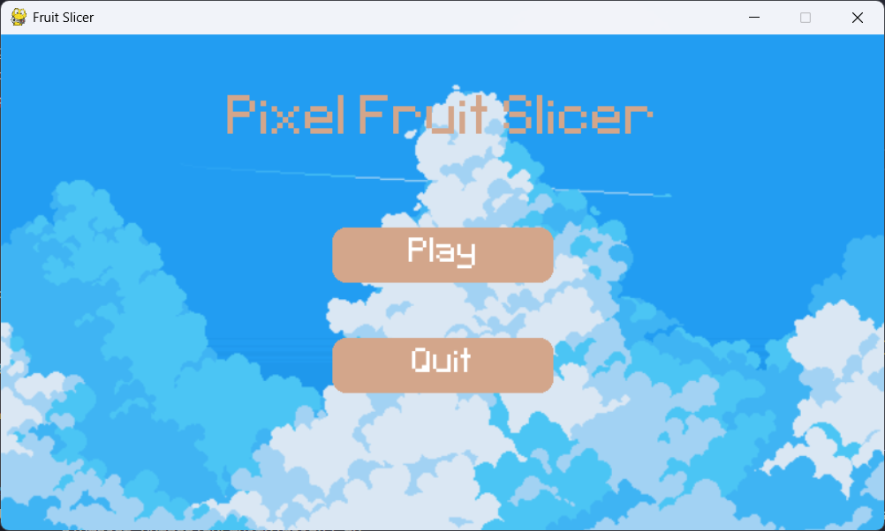
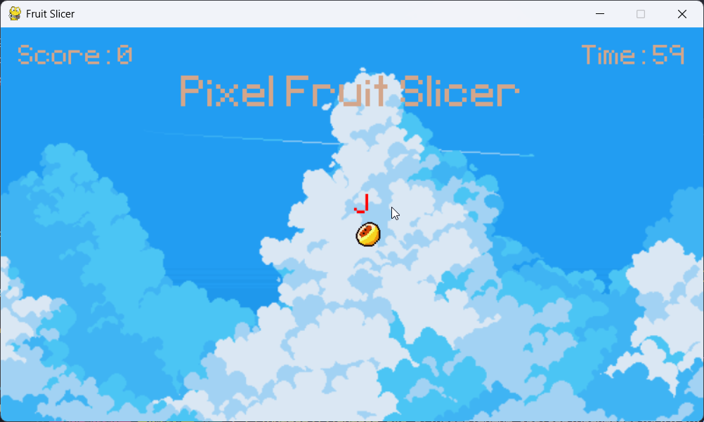

# PyFruity: A Fruit Slicing Game

[](https://www.pygame.org/)
[](https://www.python.org/)


PyFruity is a fun and engaging fruit slicing game built using Python and the Pygame library.  Slice your way through a cascade of colorful fruits, avoid the bombs, and achieve the highest score!  Inspired by classic fruit slicing games, PyFruity offers a simple yet addictive gameplay experience.

## Screenshots

  <!-- Replace with the actual path to your first image -->
*Loading screen*

  <!-- Replace with the actual path to your second image -->
*In-game screenshot*


## Features

*   **Intuitive Slicing Mechanics:**  Use your keyboard to slice through the fruits by entering the correct letter.
*   **Colorful Graphics and Animations:** Enjoy vibrant fruit sprites and satisfying slicing effects.
*   **Scoring System:** Earn points for each fruit sliced and combos.
*   **Bomb Avoidance:**  Be careful not to slice the bombs, or you'll lose points (or the game!).
*   **Game Over:** The game ends when you miss too many fruits or hit too many bombs (customize the specific conditions in the code).
*   **Sound Effects (Optional):**  If you've added sound effects, mention them here.  e.g., "Satisfying slicing sounds and bomb explosion effects."
* **High Score Tracking (Optional):** If you have implemented high score saving, mention it.

## Installation

1.  **Prerequisites:**
    *   Python 3.13 (tested with Python 3.11+)
    *   Pygame library

2.  **Install Pygame:**

    ```bash
    pip install pygame
    ```

3.  **Clone the Repository:**

    ```bash
    git clone https://github.com/RyderBlack/pyFruity.git
    cd PyFruity 
    ```

4.  **Run the Game:**

    ```bash
    python main.py 
    ```

## Gameplay Instructions

*   **Slice:**  Enter the correct letter to slice the fruits.
*   **Avoid Bombs:** Do not slice the bombs!
*   **Combos:** Slice multiple fruits in a single swipe to earn bonus points.
*   **Missed Fruits:**  Don't let too many fruits fall to the bottom of the screen.


## Contributing

We welcome contributions! If you'd like to contribute to PyFruity, please follow these steps:

1.  Fork the repository.
2.  Create a new branch (`git checkout -b feature/your-feature-name`).
3.  Make your changes.
4.  Commit your changes (`git commit -m "Add your commit message"`).
5.  Push to the branch (`git push origin feature/your-feature-name`).
6.  Create a Pull Request.

## Contributors

*   [RyderBlack](https://github.com/RyderBlack)
*   [Camille Sauret](https://github.com/camille-sauret)
*   [Akram-Rayan Abderrezzak](https://github.com/Akram-Rayan-Abderrezzak)

## License

This project is licensed under the [MIT License](LICENSE) - see the LICENSE file for details.  (You should create a LICENSE file and choose an appropriate license - MIT is a common choice for open-source projects).  If you don't want to use the MIT license, replace this section with information about your chosen license.

## Acknowledgements

*   Inspired by the classic Fruit Ninja game.
*   Pygame library for making game development in Python easy and fun.

## Future Improvements (Optional)

*   Add different game modes (e.g., Time Attack, Arcade).
*   Implement a power-up system.
*   Create more types of fruits and bombs.
*   Add a pause screen.
*   Improve sound effects and add background music.
* Add difficulty levels.
